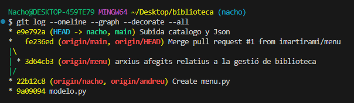

Participantes: 
    
    1. Andreu y Nacho

Distribución del trabajo: 

    1. Andreu - Inicialmente, menú y redme. Finalmente lo hizo prácticamente todo.
    2. Nacho - Inicialmente, modelo y catalogo. Finalmente, hizo catalogo y redme y revisar código.

IA:

    1. Pedimos ayuda para modificar el input (libros) y para resolver problemas de no funcionamiento con el codigo y dudas con GIT:

        "hola! en este codigo tengo varios problemas 1. quiero que lalista dentro de json se llame libros pero no se como hacerlo. 2 lista_cargada no funciona porque?"

        +Ya puedo ver claramente los dos problemas que mencionabas. Te los explico con detalle y te dejo una versión corregida al final+

        "hola me dice esto: error: Your local changes to the following files would be overwritten by checkout: biblioteca.json catalogo.py Please commit your changes or stash them before you switch branches. Aborting"

        +Ese error de Git es muy común y totalmente normal cuando tienes cambios locales sin guardar (sin commit) y tratas de cambiar de rama (git checkout, git switch, git pull, etc.).+

        etc.......
    
Módulos usados:

    1. Pathlib
    2. os
    3. Json

Historico:
    1. 

Link repositorio:
    1. https://github.com/imartirami/biblioteca.git